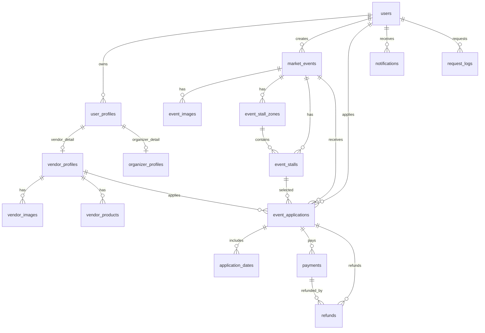

# 小集日 Market Day 資料庫規劃

## 1. 設計目標

本資料庫以 SQL Server 為主，支援「多主辦方市集活動平台」的完整流程：

- 一般使用者瀏覽活動、品牌、歷史活動與公開品牌資訊
- 攤主註冊登入、建立品牌資料、商品資料、報名活動、付款
- 主辦方建立活動、審核報名、確認付款
- 系統管理員管理全平台基本資料

主要設計原則：

- 使用 `BIGINT IDENTITY` 作為主鍵，方便長期擴充並符合 SQL Server 語法
- 狀態欄位用 `VARCHAR` 儲存，後端以 enum 控制，避免資料庫 enum 後續難改
- 重要流程先保留必要狀態，例如報名狀態與付款狀態
- 圖片依用途存放於對應資料表，例如活動圖片、品牌照片與商品圖片
- 互動式地圖、選攤位、完整操作紀錄與系統設定先作為未來補充

---

## 2. 核心 ERD

---

## 3. 帳號與權限

### 3.1 單一 `users` 表設計（整合所有角色）

本專案採用單一 `users` 表管理所有可登入帳號（攤主、主辦方、管理員），以 `role` 欄位區分不同角色。角色共用的個人/單位資料放在 `user_profiles`，攤主與主辦方專屬欄位再分別放到 `vendor_profiles`、`organizer_profiles`。

設計原則：

- 使用 `BIGINT IDENTITY(1,1)` 作為主鍵
- 角色差異由後端以 `role` enum 控制，資料庫儲存為 `VARCHAR(30)`
- `users.updated_at` 作為前端使用者主動修改會員/profile/品牌資料時的更新時間依據；登入、登出、Email 驗證與自動登出狀態不更新此欄位

建議欄位：

| 欄位名稱          | 鍵別  | FK | 型別            | 必填 | 說明                                                         |
| ----------------- | ----- | -- | --------------- | ---- | ------------------------------------------------------------ |
| id                | PK    | -  | BIGINT IDENTITY | 是   | 使用者主鍵                                                   |
| role              | INDEX | -  | VARCHAR(30)     | 是   | 帳號角色（VENDOR/ORGANIZER/ADMIN）                           |
| name              | -     | -  | NVARCHAR(100)   | 是   | 顯示名稱                                                     |
| email             | UK    | -  | VARCHAR(255)    | 是   | 登入 Email                                                   |
| password_hash     | -     | -  | VARCHAR(255)    | 否   | 密碼雜湊值（LOCAL）                                          |
| phone             | -     | -  | VARCHAR(30)     | 否   | 聯絡電話                                                     |
| provider          | INDEX | -  | VARCHAR(30)     | 是   | 登入來源（LOCAL/GOOGLE）                                     |
| status            | INDEX | -  | VARCHAR(30)     | 是   | 帳號狀態（預設 UNACTIVE；Email 驗證後自動 ACTIVE）           |
| isLogin           | INDEX | -  | BIT             | 是   | 是否已有登入中的裝置                                         |
| email_verified_at | -     | -  | DATETIME2(0)    | 否   | Email 驗證完成時間；非 NULL 時帳號由 trigger 自動轉為 ACTIVE |
| expired_time      | INDEX | -  | DATETIME2(0)    | 是   | 自動登出判斷時間                                             |
| created_at        | -     | -  | DATETIME2(0)    | 是   | 建立時間                                                     |
| updated_at        | -     | -  | DATETIME2(0)    | 是   | 更新時間                                                     |

欄位值建議：

- `role`：`VENDOR`、`ORGANIZER`、`ADMIN`
- `provider`：`LOCAL`、`GOOGLE`
- `status`：`UNACTIVE`、`ACTIVE`、`IS_DELETED`。本地帳號建立後預設 `UNACTIVE`，當 `email_verified_at` 非 NULL 時，由 trigger 自動轉為 `ACTIVE`。

### 3.2 `user_tokens` 使用者驗證與重設密碼 Token

註冊 Email 驗證與忘記密碼驗證信共用同一張 token 表，透過 `token_type` 區分用途，避免建立兩張欄位完全相同的資料表。

| 欄位名稱   | 鍵別  | FK       | 型別            | 必填 | 說明                   |
| ---------- | ----- | -------- | --------------- | ---- | ---------------------- |
| id         | PK    | -        | BIGINT IDENTITY | 是   | 使用者 token ID        |
| user_id    | INDEX | users.id | BIGINT          | 是   | 使用者 ID              |
| token      | UK    | -        | VARCHAR(100)    | 是   | 驗證或重設密碼用 token |
| token_type | INDEX | -        | VARCHAR(30)     | 是   | token 類型             |
| expires_at | INDEX | -        | DATETIME2(0)    | 是   | token 過期時間         |

欄位值建議：

- `token_type`：`EMAIL_VERIFY`、`PASSWORD_RESET`
- `EMAIL_VERIFY`：註冊後寄送 Email 驗證信，驗證成功後寫入 `users.email_verified_at`
- `PASSWORD_RESET`：忘記密碼時寄送重設密碼驗證信，驗證成功後允許修改密碼

---

## 4. 品牌、商品與分類

### 4.1 `categories` 分類

同時支援活動類型與品牌類型。

| 欄位名稱  | 鍵別 | FK | 型別            | 必填 | 說明     |
| --------- | ---- | -- | --------------- | ---- | -------- |
| id        | PK   | -  | BIGINT IDENTITY | 是   | 分類 ID  |
| name      | -    | -  | NVARCHAR(100)   | 是   | 分類名稱 |
| slug      | -    | -  | NVARCHAR(100)   | 是   | 分類代碼 |
| is_active | -    | -  | BIT             | 是   | 是否啟用 |

### 4.2 `user_profiles` 使用者共用詳細資料

此表存放攤主與主辦方共用的個人/單位聯絡資料。新增資料時必填資料需完整，因此不保留 DRAFT 狀態欄位。

| 欄位名稱      | 鍵別  | FK       | 型別               | 必填 | 說明                         |
| ------------- | ----- | -------- | ------------------ | ---- | ---------------------------- |
| id            | PK    | -        | BIGINT IDENTITY    | 是   | 個人資料 ID                  |
| user_id       | INDEX | users.id | BIGINT             | 是   | 使用者 ID                    |
| profile_type  | INDEX | -        | NVARCHAR(30)       | 是   | 資料類型（VENDOR/ORGANIZER） |
| name          | -     | -        | NVARCHAR(150)      | 是   | 名稱                         |
| contact_name  | -     | -        | NVARCHAR(100)      | 是   | 聯絡人                       |
| contact_phone | -     | -        | NVARCHAR(30)       | 是   | 聯絡電話                     |
| contact_email | -     | -        | NVARCHAR(255) NULL | 否   | 聯絡 Email                   |
| city          | -     | -        | NVARCHAR(50) NULL  | 否   | 縣市                         |
| district      | -     | -        | NVARCHAR(50) NULL  | 否   | 區                           |
| address       | -     | -        | NVARCHAR(255) NULL | 否   | 詳細地址                     |

### 4.3 `vendor_profiles` 攤主品牌專屬資料

| 欄位名稱          | 鍵別 | FK               | 型別               | 必填 | 說明           |
| ----------------- | ---- | ---------------- | ------------------ | ---- | -------------- |
| id                | PK   | -                | BIGINT IDENTITY    | 是   | 攤主品牌資料 ID |
| user_profile_id   | UK   | user_profiles.id | BIGINT             | 是   | 共用個人資料 ID |
| category_id       | FK   | categories.id    | BIGINT             | 是   | 品牌分類 ID     |
| instagram_url     | -    | -                | NVARCHAR(500) NULL | 否   | Instagram      |
| facebook_url      | -    | -                | NVARCHAR(500) NULL | 否   | Facebook       |
| website_url       | -    | -                | NVARCHAR(500) NULL | 否   | 官方網站       |
| brand_description | -    | -                | NVARCHAR(MAX) NULL | 否   | 品牌資訊       |
| brand_type        | -    | -                | NVARCHAR(100) NULL | 否   | 品牌類型       |
| product_summary   | -    | -                | NVARCHAR(MAX) NULL | 否   | 品牌商品摘要   |

### 4.4 `organizer_profiles` 主辦方專屬資料

| 欄位名稱           | 鍵別 | FK               | 型別                | 必填 | 說明           |
| ------------------ | ---- | ---------------- | ------------------- | ---- | -------------- |
| id                 | PK   | -                | BIGINT IDENTITY     | 是   | 主辦方資料 ID |
| user_profile_id    | UK   | user_profiles.id | BIGINT              | 是   | 共用個人資料 ID |
| company_name       | -    | -                | NVARCHAR(150) NULL  | 否   | 公司名稱       |
| tax_id             | -    | -                | NVARCHAR(20) NULL   | 否   | 統一編號       |
| service_days       | -    | -                | NVARCHAR(100) NULL  | 否   | 服務星期       |
| service_start_time | -    | -                | TIME(0) NULL        | 否   | 服務開始時間   |
| service_end_time   | -    | -                | TIME(0) NULL        | 否   | 服務結束時間   |

### 4.5 `vendor_images` 品牌圖片

用來存放品牌大頭照、品牌封面與品牌照片。圖片關聯到 `vendor_profiles`，避免主辦方資料誤連品牌圖片。

| 欄位名稱          | 鍵別 | FK                 | 型別            | 必填 | 說明             |
| ----------------- | ---- | ------------------ | --------------- | ---- | ---------------- |
| id                | PK   | -                  | BIGINT IDENTITY | 是   | 照片 ID          |
| vendor_profile_id | FK   | vendor_profiles.id | BIGINT          | 是   | 攤主品牌資料 ID  |
| image_type        | -    | -                  | NVARCHAR(30)    | 是   | 圖片類型         |
| image_url         | -    | -                  | NVARCHAR(500)   | 是   | 圖片路徑         |

索引與規則：

- `INDEX(vendor_profile_id, image_type)`
- `image_type`：`AVATAR`（品牌大頭貼 / LOGO）、`COVER`（品牌封面）、`GALLERY`（其他品牌圖片）
- SQL Server filtered unique index：`UNIQUE(vendor_profile_id) WHERE image_type = 'AVATAR'`，限制每個品牌只能有一張大頭貼 / LOGO。
- SQL Server filtered unique index：`UNIQUE(vendor_profile_id) WHERE image_type = 'COVER'`，限制每個品牌只能有一張封面。
- `image_type = GALLERY` 可保留多張，用於前台品牌詳細與攤主後台我的品牌。

### 4.6 `vendor_products` 品牌商品

| 欄位名稱          | 鍵別 | FK                 | 型別               | 必填 | 說明            |
| ----------------- | ---- | ------------------ | ------------------ | ---- | --------------- |
| id                | PK   | -                  | BIGINT IDENTITY    | 是   | 商品 ID         |
| vendor_profile_id | FK   | vendor_profiles.id | BIGINT             | 是   | 攤主品牌資料 ID |
| name              | -    | -                  | NVARCHAR(150)      | 是   | 商品名稱        |
| short_description | -    | -                  | NVARCHAR(255)      | 是   | 商品簡介        |
| description       | -    | -                  | NVARCHAR(MAX) NULL | 否   | 商品介紹        |
| price             | -    | -                  | DECIMAL(10,2) NULL | 否   | 商品價格        |
| image_url         | -    | -                  | NVARCHAR(500) NULL | 否   | 商品圖片        |
| status            | -    | -                  | NVARCHAR(30)       | 是   | 商品狀態        |

---

## 5. 市集活動

### 5.1 `market_events` 市集活動

| 欄位名稱              | 鍵別  | FK            | 型別               | 必填 | 說明                |
| --------------------- | ----- | ------------- | ------------------ | ---- | ------------------- |
| id                    | PK    | -             | BIGINT IDENTITY    | 是   | 活動 ID             |
| user_id               | FK    | users.id      | BIGINT             | 是   | 主辦方 ID           |
| category_id           | FK    | categories.id | BIGINT             | 是   | 活動分類            |
| title                 | -     | -             | NVARCHAR(200)      | 是   | 活動名稱            |
| summary               | -     | -             | NVARCHAR(300)      | 是   | 活動摘要            |
| description           | -     | -             | NVARCHAR(MAX)      | 是   | 活動介紹            |
| location_name         | -     | -             | NVARCHAR(200)      | 是   | 地點名稱            |
| city                  | -     | -             | NVARCHAR(50)       | 是   | 縣市                |
| district              | -     | -             | NVARCHAR(50) NULL  | 否   | 區域                |
| address               | -     | -             | NVARCHAR(255)      | 是   | 地址                |
| traffic_info          | -     | -             | NVARCHAR(MAX) NULL | 否   | 交通方式            |
| notice                | -     | -             | NVARCHAR(MAX) NULL | 否   | 活動注意事項        |
| start_date            | -     | -             | DATE               | 是   | 活動開始日          |
| end_date              | -     | -             | DATE               | 是   | 活動結束日          |
| start_time            | -     | -             | TIME(0) NULL       | 否   | 每日開始時間        |
| end_time              | -     | -             | TIME(0) NULL       | 否   | 每日結束時間        |
| registration_start_at | -     | -             | DATETIME2(0)       | 是   | 報名開始時間        |
| registration_end_at   | -     | -             | DATETIME2(0)       | 是   | 報名截止時間        |
| max_booths            | -     | -             | INT                | 是   | 攤位總數            |
| base_fee              | -     | -             | DECIMAL(10,2)      | 是   | 基本攤位費          |
| cover_image_url       | -     | -             | NVARCHAR(500) NULL | 否   | 活動封面            |
| map_image_url         | -     | -             | NVARCHAR(500) NULL | 否   | 攤位地圖底圖        |
| public_info_at        | -     | -             | DATETIME2(0) NULL  | 否   | 公開資訊時間        |
| review_status         | INDEX | -             | NVARCHAR(30)       | 是   | 活動審核狀態        |
| review_note           | -     | -             | NVARCHAR(MAX) NULL | 否   | 補件原因 / 審核備註 |
| publish_status        | INDEX | -             | NVARCHAR(30)       | 是   | 活動發布狀態        |

欄位值建議：

- `review_status`：`APPROVED`、`REJECTED`、`REVISION_REQUIRED`、`CANCELLED`
- `publish_status`：`DRAFT`、`PUBLISHED`、`UNPUBLISHED`、`CANCELLED`

### 5.2 `event_images` 活動圖片

| 欄位名稱  | 鍵別 | FK               | 型別            | 必填 | 說明     |
| --------- | ---- | ---------------- | --------------- | ---- | -------- |
| id        | PK   | -                | BIGINT IDENTITY | 是   | 圖片 ID  |
| event_id  | FK   | market_events.id | BIGINT          | 是   | 活動 ID  |
| image_url | -    | -                | NVARCHAR(500)   | 是   | 圖片路徑 |

### 5.3 `event_stall_zones` 活動攤位分區

用來管理活動場地中的攤位分區，例如 A 區、B 區，方便後續產生攤位與前後台顯示。

| 欄位名稱    | 鍵別 | FK               | 型別            | 必填 | 說明         |
| ----------- | ---- | ---------------- | --------------- | ---- | ------------ |
| id          | PK   | -                | BIGINT IDENTITY | 是   | 分區 ID      |
| event_id    | FK   | market_events.id | BIGINT          | 是   | 活動 ID      |
| zone_name   | -    | -                | NVARCHAR(50)    | 是   | 分區名稱     |
| stall_count | -    | -                | INT             | 是   | 分區攤位數量 |

### 5.4 `event_stalls` 活動攤位

用來記錄活動中可被攤主選擇的實體攤位。當 `event_applications.selected_stall_id` 指向某個 `event_stalls.id` 時，該攤位狀態可由 `AVAILABLE` 改為 `SELECTED` 或 `SOLD`。

| 欄位名稱 | 鍵別 | FK                   | 型別              | 必填 | 說明               |
| -------- | ---- | -------------------- | ----------------- | ---- | ------------------ |
| id       | PK   | -                    | BIGINT IDENTITY   | 是   | 攤位 ID            |
| event_id | FK   | market_events.id     | BIGINT            | 是   | 活動 ID            |
| zone_id  | FK   | event_stall_zones.id | BIGINT            | 是   | 分區 ID            |
| stall_no | -    | -                    | NVARCHAR(30)      | 是   | 攤位編號，例如 A01 |
| width    | -    | -                    | DECIMAL(6,2) NULL | 否   | 攤位寬度           |
| length   | -    | -                    | DECIMAL(6,2) NULL | 否   | 攤位長度           |
| height   | -    | -                    | DECIMAL(6,2) NULL | 否   | 攤位高度           |
| status   | -    | -                    | NVARCHAR(30)      | 是   | 攤位狀態           |

欄位值建議：

- `status`：`AVAILABLE`、`SELECTED`、`SOLD`、`DISABLED`

---

## 6. 報名、審核與需求

### 6.1 `event_applications` 市集報名

| 欄位名稱          | 鍵別 | FK               | 型別               | 必填 | 說明               |
| ----------------- | ---- | ---------------- | ------------------ | ---- | ------------------ |
| id                | PK   | -                | BIGINT IDENTITY    | 是   | 報名 ID            |
| application_no    | UK   | -                | NVARCHAR(30)       | 是   | 報名編號           |
| event_id          | FK   | market_events.id | BIGINT             | 是   | 活動 ID            |
| user_id           | FK   | users.id         | BIGINT             | 是   | 攤主 ID            |
| vendor_profile_id | FK   | vendor_profiles.id | BIGINT           | 是   | 攤主品牌資料 ID    |
| selected_stall_id | FK   | event_stalls.id  | BIGINT NULL        | 否   | 選擇的活動攤位     |
| vehicle_no        | -    | -                | NVARCHAR(30) NULL  | 否   | 車牌               |
| applicant_note    | -    | -                | NVARCHAR(MAX) NULL | 否   | 攤主備註           |
| total_amount      | -    | -                | DECIMAL(10,2)      | 是   | 試算總金額         |
| deposit_amount    | -    | -                | DECIMAL(10,2)      | 是   | 保證金金額，預設 0 |
| deposit_status    | -    | -                | NVARCHAR(30)       | 是   | 保證金狀態         |
| payment_due_at    | -    | -                | DATETIME2(0) NULL  | 否   | 付款期限           |
| review_status     | -    | -                | NVARCHAR(30)       | 是   | 報名審核狀態       |
| review_note       | -    | -                | NVARCHAR(MAX) NULL | 否   | 報名審核未通過原因 |
| payment_status    | -    | -                | NVARCHAR(30)       | 是   | 報名付款狀態       |
| is_cancelled      | INDEX | -               | BIT                | 是   | 報名是否取消       |
| created_at        | INDEX | -               | DATETIME2(0)       | 是   | 報名建立時間       |

欄位值建議：

- `review_status`：`PENDING`（待審核）、`APPROVED`（審核通過）、`REJECTED`（審核未通過）
- `deposit_status`：`NOT_RETURNED`（尚未退還保證金）、`RETURNED`（保證金已退還）
- `payment_status`：`PENDING`（待付款）、`PAID`（付款成功）、`FAILED`（付款失敗）、`EXPIRED`（付款逾期）
- `is_cancelled`：統一記錄報名是否取消；不再用 `review_status` 或 `payment_status` 表示取消。

### 6.2 `application_dates` 報名參加日期

用來記錄一筆報名實際參加活動中的哪些日期；一筆報名可有多筆參加日期。

| 欄位名稱       | 鍵別 | FK                    | 型別            | 必填 | 說明         |
| -------------- | ---- | --------------------- | --------------- | ---- | ------------ |
| id             | PK   | -                     | BIGINT IDENTITY | 是   | ID           |
| application_id | FK   | event_applications.id | BIGINT          | 是   | 報名 ID      |
| apply_date     | INDEX | -                    | DATE            | 是   | 報名參加日期 |

## 7. 付款與金流

### 7.1 `payments` 付款紀錄

一筆報名可有多次付款嘗試。

| 欄位名稱          | 鍵別 | FK                    | 型別               | 必填 | 說明         |
| ----------------- | ---- | --------------------- | ------------------ | ---- | ------------ |
| id                | PK   | -                     | BIGINT IDENTITY    | 是   | 付款 ID      |
| payment_no        | UK   | -                     | NVARCHAR(40)       | 是   | 付款編號     |
| application_id    | FK   | event_applications.id | BIGINT             | 是   | 報名 ID      |
| amount            | -    | -                     | DECIMAL(10,2)      | 是   | 付款金額     |
| provider          | -    | -                     | NVARCHAR(30) NULL  | 否   | 金流服務商   |
| provider_trade_no | -    | -                     | NVARCHAR(100) NULL | 否   | 金流交易編號 |
| status            | -    | -                     | NVARCHAR(30)       | 是   | 付款狀態     |
| paid_at           | -    | -                     | DATETIME2(0) NULL  | 否   | 付款成功時間 |
| created_at        | -    | -                     | DATETIME2(0)       | 是   | 建立時間     |

欄位刪減說明：

- 系統僅保留信用卡付款，因此不需要 `method`、`virtual_account`、`cvs_code`。
- `provider` 若確定只會長期使用單一金流服務商，技術上可刪除；但建議保留，方便日後對帳、追查歷史資料或更換金流服務商。
- `provider_trade_no` 建議保留，作為金流平台回傳交易編號，用於查詢、對帳與退款關聯。

欄位值建議：

- `status`：`PENDING`（待付款）、`PAID`（付款成功）、`FAILED`（付款失敗）、`EXPIRED`（已逾期）

### 7.2 `refunds` 退款紀錄

一筆報名可建立退款紀錄，必要時可關聯原始付款紀錄。

| 欄位名稱       | 鍵別 | FK                    | 型別              | 必填 | 說明             |
| -------------- | ---- | --------------------- | ----------------- | ---- | ---------------- |
| id             | PK   | -                     | BIGINT IDENTITY   | 是   | 退款 ID          |
| refund_no      | UK   | -                     | NVARCHAR(40)      | 是   | 退款編號         |
| application_id | FK   | event_applications.id | BIGINT            | 是   | 報名 ID          |
| payment_id     | FK   | payments.id           | BIGINT NULL       | 否   | 原付款紀錄       |
| amount         | -    | -                     | DECIMAL(10,2)     | 是   | 退款金額         |
| refund_status  | -    | -                     | NVARCHAR(30)      | 是   | 退款處理狀態     |
| refunded_at    | -    | -                     | DATETIME2(0) NULL | 否   | 實際退款完成時間 |

欄位值建議：

- `refund_status`：`REFUND_REQUESTED`（退款申請中）、`REFUNDING`（退款處理中）、`REFUND_FAILED`（退款失敗）、`REFUNDED`（已退款）

---

## 8. 通知管理

此章只處理攤主後台首頁與通知中心顯示的站內通知。通知只顯示給對應使用者，不設計跳轉到報名、付款或活動詳細頁的關聯功能。

### 8.1 `notifications` 站內通知

| 欄位名稱 | 鍵別 | FK       | 型別            | 必填 | 說明     |
| -------- | ---- | -------- | --------------- | ---- | -------- |
| id       | PK   | -        | BIGINT IDENTITY | 是   | 通知 ID  |
| user_id  | FK   | users.id | BIGINT          | 是   | 接收者   |
| type     | -    | -        | NVARCHAR(50)    | 是   | 通知類型 |
| title    | -    | -        | NVARCHAR(150)   | 是   | 通知標題 |
| content  | -    | -        | NVARCHAR(MAX)   | 是   | 通知內容 |

---

## 9. 操作紀錄與系統設定(管理員log)

目前先不實作完整管理員操作紀錄與系統設定，核心功能完成後再補 `audit_logs` 與 `system_settings`。

### 9.1 `request_logs` API 請求紀錄（待做）

此表先作為待做項目，目標是讓後端收到 request 時可以留下基本紀錄，方便開發與除錯。初版可由後端 middleware 統一寫入。

| 欄位名稱    | 鍵別 | FK       | 型別            | 必填 | 說明        |
| ----------- | ---- | -------- | --------------- | ---- | ----------- |
| id          | PK   | -        | BIGINT IDENTITY | 是   | 請求紀錄 ID |
| user_id     | FK   | users.id | BIGINT NULL     | 否   | 發送請求者  |
| method      | -    | -        | NVARCHAR(10)    | 是   | HTTP 方法   |
| path        | -    | -        | NVARCHAR(500)   | 是   | API 路徑    |
| status_code | -    | -        | INT NULL        | 否   | 回應狀態碼  |
| created_at  | -    | -        | DATETIME2(0)    | 是   | 建立時間    |

資料表範例：

使用者送出報名 API 時，後端處理 request 後新增一筆 `request_logs`，記錄 `method = POST`、`path = /api/applications`、`status_code = 200`。

---
